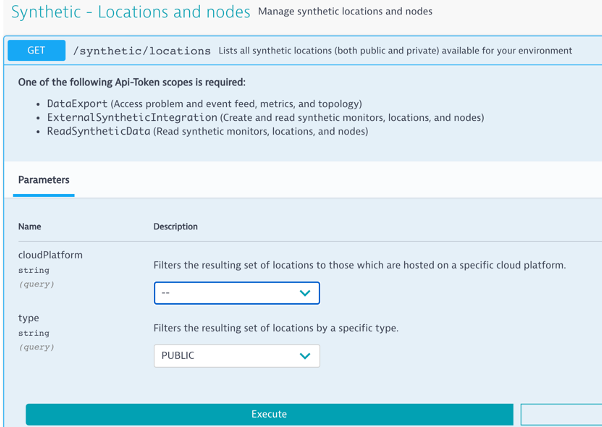

# Configuration Examples

Typically these sorts of configuration updates are best handled via a configuration as code framework such as Terraform, but are provided as examples to calling the Dynatrace API.

# Library functions

| Library Function | Description |
| --- | --- |
| dt_createUpdateAppDetectionRule | Used to create or update an existing [Application Detection Rule](https://www.dynatrace.com/support/help/dynatrace-api/configuration-api/rum/application-detection-configuration/) |
| dt_createUpdateDashboard | Used to create or update an existing [Dashboard](https://www.dynatrace.com/support/help/dynatrace-api/configuration-api/dashboards-api/) |
| dt_createUpdateManagementZone | Used to create or update an existing [Management Zone](https://www.dynatrace.com/support/help/dynatrace-api/configuration-api/management-zones-api/) |
| dt_createUpdateSyntheticTest | Used to create or update an existing synthetic [HTTP monitor](https://www.dynatrace.com/support/help/how-to-use-dynatrace/synthetic-monitoring/http-monitors/create-an-http-monitor/) |

# Examples

See example Jenkinsfiles in the [examples folder](examples)

# Additonal Usage Details

The **location** string is required for the HTTP monitor can be obtained from the [Dynatrace get locations API](https://www.dynatrace.com/support/help/dynatrace-api/environment-api/synthetic/synthetic-locations/get-all-locations/). The Dynatace Swagger Web UI, is a quick way to get available locations.

