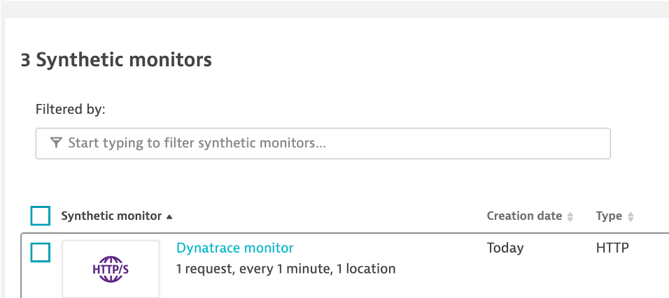

# Synthetic HTTP monitor

Below is what Dynatrace HTTP monitor look like.

# Library functions

| Library Function | Description |
| --- | --- |
| dt_createUpdateSyntheticTest | Used to create or update an existing synthetic test in Dynatrace based on test name |

# Examples

See example Jenkinsfiles in the [examples folder](examples)

# Additonal Usage Details

The **location** string is required and can be obtained from the [Dynatrace get locations API](https://www.dynatrace.com/support/help/dynatrace-api/environment-api/synthetic/synthetic-locations/get-all-locations/). The Dynatace Swagger Web UI, is a quick way to get available locations.

