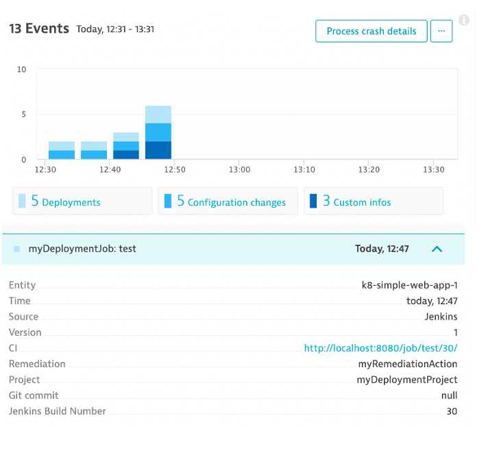

# Information Events

Send deployment, configuration, and testing context for monitored services using the [Dynatrace API](https://www.dynatrace.com/support/help/dynatrace-api/environment-api/events-v2).

Below is what Dynatrace events look like.



# Library functions

| Class | Library Function | Description |
| --- | --- | --- |
| Event | pushDynatraceEvent | Used to push an Event to Dynatrace |

# Mandatory parameters

* `title`
* `eventType`

# Examples

See example Jenkinsfiles in the [examples folder](examples)

# Additonal Usage Details

These functions work best with an [entitySelector](https://www.dynatrace.com/support/help/shortlink/api-entities-v2-selector) to target specific entities.

Here is an example of a process.


Here is an example selector to address the process group intance.

```
def selector = "type(PROCESS_GROUP_INSTANCE),entityName(nginx)"
```

In addition to the to required fields, additonal properties can be added too, for example:

```
properties : [
  "Jenkins JOB_NAME": "${env.JOB_NAME}",
  "Jenkins BUILD_NUMBER": "${env.BUILD_NUMBER}"
  "dt.event.description": "myDescription",
  "dt.event.source": "Jenkins"
]
```

Check /api/v2/eventProperties for a full list of native Dynatrace properties.