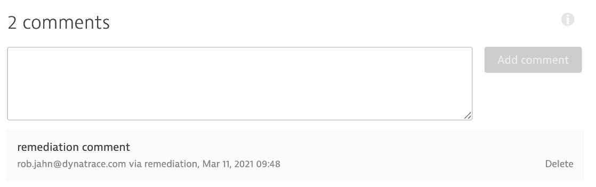

# Problem Examples

Provided as examples to calling the [Dynatrace v2 problem API](https://www.dynatrace.com/support/help/dynatrace-api/environment-api/problems-v2/)

# Library functions

| Class | Library Function | Description |
| --- | --- | --- |
| Problem | postProblemComment | Add a [Problem Comment](https://www.dynatrace.com/support/help/dynatrace-api/environment-api/problems-v2/problems/post-close/) for an existing Dynatrace Problem ID |
| Problem | closeProblem | [Close a Problem](https://www.dynatrace.com/support/help/dynatrace-api/environment-api/problems-v2/problems/post-close/) for an existing Dynatrace Problem ID.  Optionally provide a comment |

# Example 

Below is what Dynatrace events look like for this example:

```
    stage("postProblemComment") {
        when {
            expression { env.DT_PROBLEM_ID }
        }
        steps {
            script {    
                def status = problem.postProblemComment (
                    problemId: "${env.DT_PROBLEM_ID}",
                    message: "remediation comment",
                    context: "remediation"
                )
                if(!status){
                error('Aborting the build.')
                } 
            }
        }
    }
```



# Authentication

To execute these functions, your API Token needs have **Write problems (problems.write)** V2 API permission.
