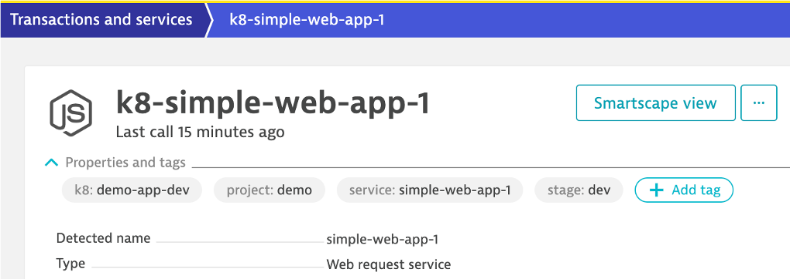

# Information Events

Send deployment, configuration, and testing context for monitored services using the [Dynatrace API](https://www.dynatrace.com/support/help/dynatrace-api/environment-api/events/post-event).

Below is what Dynatrace events look like.


# Library functions

| Library Function | Description |
| --- | --- |
| dt_pushDynatraceAnnotationEvent | Used to push a Annotatio Event to Dynatrace |
| dt_pushDynatraceConfigurationEvent | Used to push a Configuration Changed Event to Dynatrace |
| dt_pushDynatraceDeploymentEvent | Used to push a Deployment Event to Dynatrace |
| dt_pushDynatraceInfoEvent | Used to push a Information Event to Dynatrace |

# Examples

See example Jenkinsfiles in the [examples folder](examples)

# Additonal Usage Details

These functions work best with a [TagRule](https://www.dynatrace.com/support/help/shortlink/api-events-post-event#events-post-parameter-tagmatchrule) as to target specific services using [Dynatrace tags](https://www.dynatrace.com/support/help/how-to-use-dynatrace/tags-and-metadata/).  

Here is an example service with a few tags.



Here is an example rule for a service.

```
def tagMatchRules = [[
  "meTypes": [ "SERVICE"],
  tags: [
    ["context": "CONTEXTLESS", "key": "project", "value": "demo"],
    ["context": "CONTEXTLESS", "key": "stage", "value": "dev"],
    ["context": "CONTEXTLESS", "key": "service", "value": "simple-web-app-1"]
  ]
]]
```

In addition to the to required fields, additonal properties can be added too, for example:

```
customProperties : [
    "Jenkins Build Number": env.BUILD_ID,
    "GIT COMMIT": env.GIT_COMMIT
  ]
```
