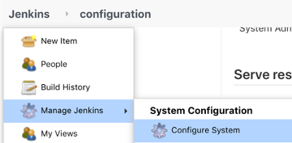
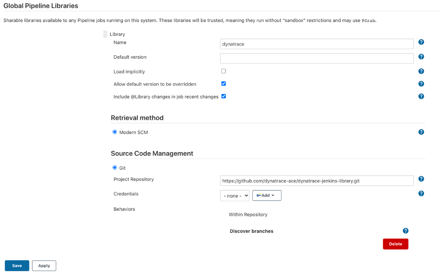
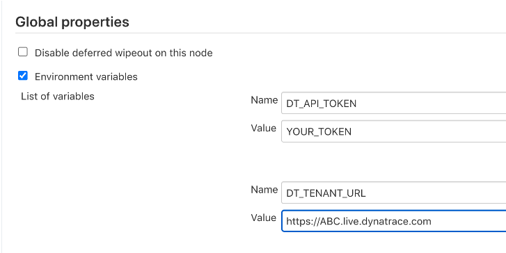
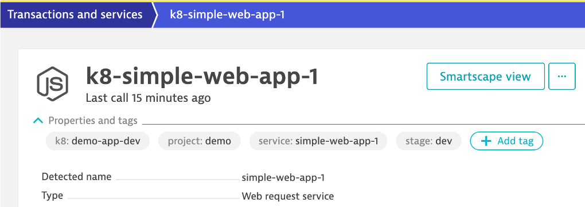
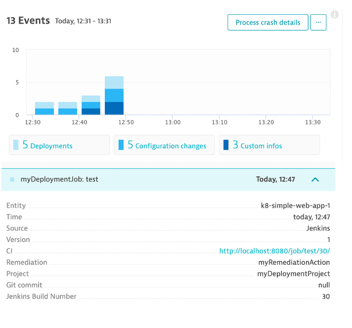
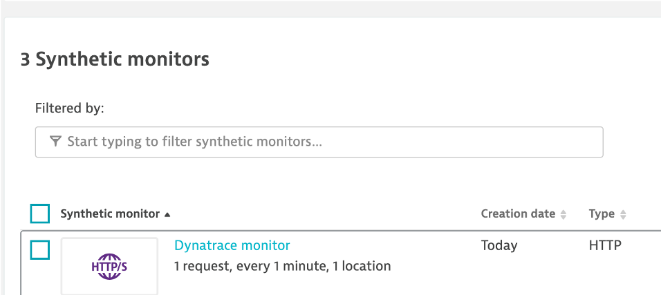
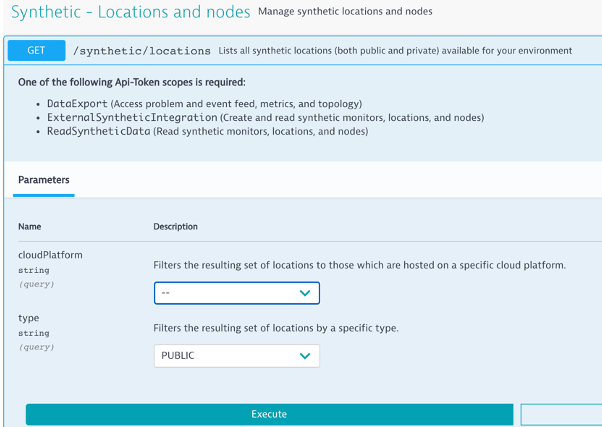

# Overview

This Groovy based library provides functions that can be used in your Jenkins pipelines that call the Dynatrace API.  

Use Cases:
* **Information Events** Send deployments, configuration changes, and testing activity for monitored services. [Review Dynatrace API](https://www.dynatrace.com/support/help/dynatrace-api/environment-api/events/post-event). 
* **Synthetic monitor** Create synthetic HTTP monitors to check the availability of your resources—websites or API endpoints. [Learn more](https://www.dynatrace.com/support/help/how-to-use-dynatrace/synthetic-monitoring/http-monitors/create-an-http-monitor/). [Review Dynatrace API](https://www.dynatrace.com/support/help/dynatrace-api/environment-api/synthetic/synthetic-monitors/post-a-monitor/)

# Setup

## Prerequisites

**#1 - Jenkins server**  

You may have your own, but if not one option is to run Jenkins as [Docker container](https://github.com/jenkinsci/docker/blob/master/README.md).  This command will start it up and prompt for setting up initial user and default plugins.
```
docker run -p 8080:8080 -p 50000:50000 -v jenkins_home:/var/jenkins_home jenkins/jenkins:lts
```

**#2 - Dynatrace tenant and API Token**

If you don't have Dynatrace, then sign up for a [free trial](https://www.dynatrace.comc/trial). To generate a Dynatrace API token, follow these steps:

1. Select Settings in the navigation menu.
1. Go to Integration > Dynatrace API.
1. Select Generate token.
1. Enter a name for your token.
1. You can accept the default, but you need API v1 **Read and Write configuration** permissions 
1. Select Generate.

## Install and configure the Dynatrace Jenkins Library

1. Login to Jenkins 
1. Navigate to Manage Jenkins > Configure System

    

1. Find the **Global Pipeline Libraries** section, click add new and fill in as shown below

    * Select **Git** as the type
    * Project repositotry = https://github.com/dynatrace-ace/dynatrace-jenkins-library.git

    

1. Find the **Global properties** section, click the **Environment variables** checkbox and add these two variables as shown below 

    * DT_API_TOKEN = The API token created for you Dynatrace tenant
    * DT_TENANT_URL = The URL to your Dynatrace tenant      

    

1. Save settings

# Usage

The Dynatrace URL and API token are configured in Jenkins or passed to various library function.  Each function takes various parameters that are required by the Dynatrace API.  Within the Jenkinsfile, the library is added with this directive: `@Library('dynatrace@master') _` added to the top of the script.

See example Jenkinsfiles in the [examples folder](examples)

Library function Categories:
* [Information Events functions](#Information-Events-functions)
* [Synthetic HTTP monitor functions](#Synthetic-HTTP-monitor-functions)

## Information Events functions

| Library Function | Description |
| --- | --- |
| pushDynatraceDeploymentEvent | Used to push a Deployment Event to Dynatrace |
| pushDynatraceConfigurationEvent | Used to push a Configuration Changed Event to Dynatrace |
| pushDynatraceInfoEvent | Used to push a Info  Event to Dynatrace |

These functions work best with a [TagRule](https://www.dynatrace.com/support/help/shortlink/api-events-post-event#events-post-parameter-tagmatchrule) as to target a specific service using [Dynatrace tags](https://www.dynatrace.com/support/help/how-to-use-dynatrace/tags-and-metadata/).  

Here is an example service with a few tags.



Here is an example rule for a service.

```
def tagMatchRules = [
  [
    meTypes: [
      [meType: 'SERVICE']
    ],
    tags: [
      [context: 'CONTEXTLESS', key: 'project', value: 'demo'],
      [context: 'CONTEXTLESS', key: 'stage', value: 'dev'],
      [context: 'CONTEXTLESS', key: 'service', value: 'simple-web-app-1']
    ]
  ]
]
```

Here is what the Jenkins job output looks like. You want to see **storedEventIds** that indicate an event was created

```
Running on Jenkins in /var/jenkins_home/workspace/test
[Pipeline] {
[Pipeline] stage
[Pipeline] { (deploy)
[Pipeline] script
[Pipeline] {
[Pipeline] echo
[Pipeline] sh
+ curl -X POST https://XXXXX.com/api/v1/events?Api-Token=YYYY -H accept: application/json -H Content-Type: application/json -d { "eventType": "CUSTOM_DEPLOYMENT", "attachRules": { "tagRule" : [{ "meTypes" : ["SERVICE"], "tags" : [ { "context" : "CONTEXTLESS", "key" : "project", "value" : "demo" }, { "context" : "CONTEXTLESS", "key" : "stage", "value" : "dev" }, { "context" : "CONTEXTLESS", "key" : "service", "value" : "simple-web-app-1" } ] }] }, "deploymentName":"myDeploymentJob: test", "deploymentVersion":"1", "deploymentProject":"myDeploymentProject", "ciBackLink":"http://localhost:8080/job/test/30/", "remediationAction":"myRemediationAction", "source":"Jenkins", "customProperties": { "Jenkins Build Number": "30", "Git commit": "null"} }
  % Total    % Received % Xferd  Average Speed   Time    Time     Time  Current
                                 Dload  Upload   Total   Spent    Left  Speed

  0     0    0     0    0     0      0      0 --:--:-- --:--:-- --:--:--     0
100   739  100   116  100   623    232   1246 --:--:-- --:--:-- --:--:--  1248
{"storedEventIds":[6029523590365053785],"storedIds":["6029523590365053785_1603298823550"],"storedCorrelationIds":[]}
[Pipeline] }
```

Here is what created events look like in Dynatrace.




## Synthetic HTTP monitor functions

| Library Function | Description |
| --- | --- |
| dt_createUpdateSyntheticTest | Used to create or update an existing synthetic test in Dynatrace based on test name |

The result is a HTTP monitor for a specified location, frequency and URL as shown below:



The **location** string is required and can be obtained from the [Dynatrace get locations API](https://www.dynatrace.com/support/help/dynatrace-api/environment-api/synthetic/synthetic-locations/get-all-locations/). The Dynatace Swagger Web UI, is a quick way to get available locations.




