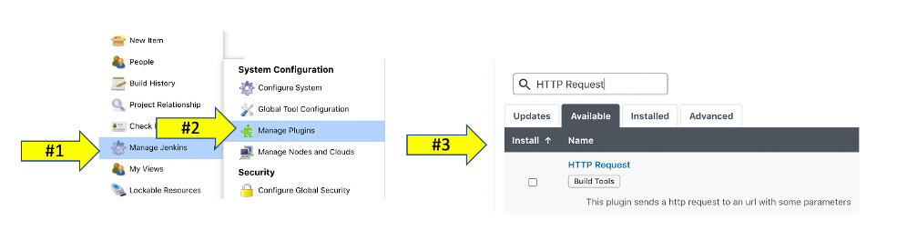
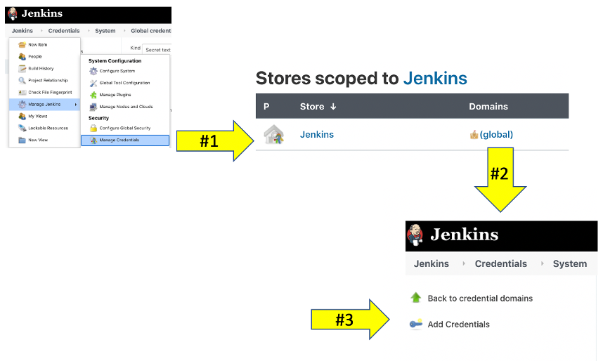
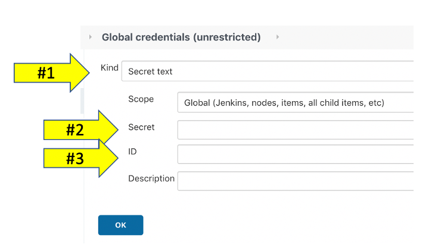
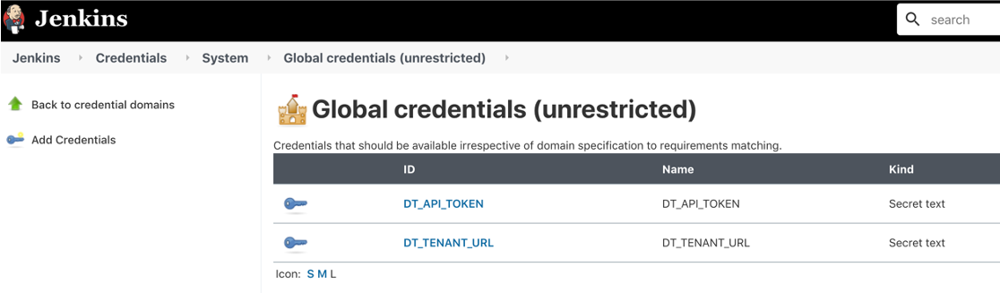

# Overview

Jenkins shared library for integrating calls the Dynatrace API with your Jenkins Pipelines.

## Usage

The directive `@Library('dynatrace@master')` is added to the top of a Jenkinsfile script to load the latest version of the Dynatrace Jenkins library. Then within the various pipeline stages, Dynatrace library functions are called with the required and optional parameters that map to the required by the Dynatrace API requests.  The Dynatrace URL and API token is configured within Jenkins or can be optionally passed as a parameter to the function call. 

Library versions are listed below:  

| Library Version | Comment |
| --------------- | ------- |
| 1.0 | Initial Release |
| 1.1 | Converted scripts into classes. Added problem functions. Added and updated README files. Added example jenkinfiles. Remove deprecated Dynatrace push, jmeter, and keptn functions |

*It is recommended to specify the library version in the Jenkinsfile to ensure pipeline stability. For example `@Library('dynatrace@1.1')`*

## Library functions:

**1. Push Information Events** 
  * Send deployment, configuration, and testing Dynatrace informational events. 
  * [Information Events](PUSHEVENTS.md) for usage details.

**2. Problems** 
  * Add problem comment and close a problem. 
  * [Information Events](PROBLEM.md) for usage details.

**3. Configuration** 
  * Dynatrace configuration functions that show various examples to perform Dynatrace configurations, but we encourage you to look at [Dynatrace monitoring as Code](https://github.com/dynatrace-oss/dynatrace-monitoring-as-code) as the recommended approach.
  * [Configuration](CONFIGURATION.md) for usage details.

Once you have everything configured use it in your Jenkins Pipeline like this

```groovy

// Import Dynatrace library
@Library("dynatrace@master")

// Initialize the class with the event methods
def event = new com.dynatrace.ace.Event()

// this is called with a script step
def status = event.pushDynatraceDeploymentEvent() (
  tagRule: tagMatchRules,
  deploymentName: "myDeploymentJob: ${env.JOB_NAME}",
  deploymentVersion: "myDeploymentVersion",
  deploymentProject: "myDeploymentProject",
  remediationAction: "myRemediationAction",
  customProperties : [
    "Jenkins Build Number": env.BUILD_ID
  ]
)

```

# Setup

## Prerequisites

**#1 - Jenkins server**  

You may have your own, but if not one option is to run Jenkins as [Docker container](https://github.com/jenkinsci/docker/blob/master/README.md).  This command will start it up and prompt for setting up initial user and default plugins.
```
docker run -p 8080:8080 -p 50000:50000 -v jenkins_home:/var/jenkins_home jenkins/jenkins:lts
```

**#2 Pre-Requisits on Jenkins**

This Jenkins Shared Library requires the following Jenkins Plugins to be installed on your Jenkins server.

| Jenkins Plugin | Comment | Tested Version |
| -------------- | -------- | ------------ |
| [httpRequest Plugin](https://plugins.jenkins.io/http_request/) | Uses httpRequest to make REST Calls to Keptn | Tested with 1.8.26 | 

To install and verify plugins, navigate to **Manage Plugins**.

  

**#3 - Dynatrace tenant and API Token**

If you don't have Dynatrace, then sign up for a [free trial](https://www.dynatrace.comc/trial). To generate a Dynatrace API token, follow these steps:

1. Select Settings in the navigation menu.
1. Go to Integration > Dynatrace API.
1. Select Generate token.
1. Enter a name for your token.
1. You can accept the default, but you need API v1 **Read and Write configuration** permissions 
1. Select Generate.

## Install and configure the Dynatrace Jenkins Library

1. Login to Jenkins 
1. Navigate to Manage Jenkins > Configure System

    

1. Find the **Global Pipeline Libraries** section, click add new and fill in as shown below

    * Select **Git** as the type
    * Project repositotry = https://github.com/dynatrace-ace/dynatrace-jenkins-library.git

    

## Configure the Dynatrace URL and API Token

The Dynatrace URL and API Token can be passed into the function calls, but by default they look for Jenkins environment variables for these values. 

These values can be set in the **Global properties** section of Jenkins, but the recommended way is to configure these secrets as **Global credentials** so that Jenkins masks the value in any Jenkins logs.  Below are the instructions for this approach. 

1. Login to Jenkins 
1. Navigate to Manage Jenkins > Manage Credentials
1. Click on the **(global)** scope within the **Stores scoped to Jenksins** section.
1. Click the **Add creditials** menu optioj

    

1. Fill in the values as follows:

    1 . Kind = Secret Text

    2 . Secret = The URL to your Dynatrace tenant
    
    3 . ID = DT_TENANT_URL
  
  

1. Click **OK** to save. Then click the **Add creditials** menu option again
1. Fill in the values as follows:

    1 . Kind = Secret Text

    2 . Secret = The API token created for you Dynatrace tenant

    3 . ID = DT_API_TOKEN

1. Click **OK** to save. When you are done, you should see this.

    

# Support

If you’d like help with this pipe, or you have an issue or feature request, let us know. The repo is maintained by Dynatrace. You can contact us directly at ace@dynatrace.com.

If you’re reporting an issue, please include:

* the version of the pipe
* relevant logs and error messages
* steps to reproduce
